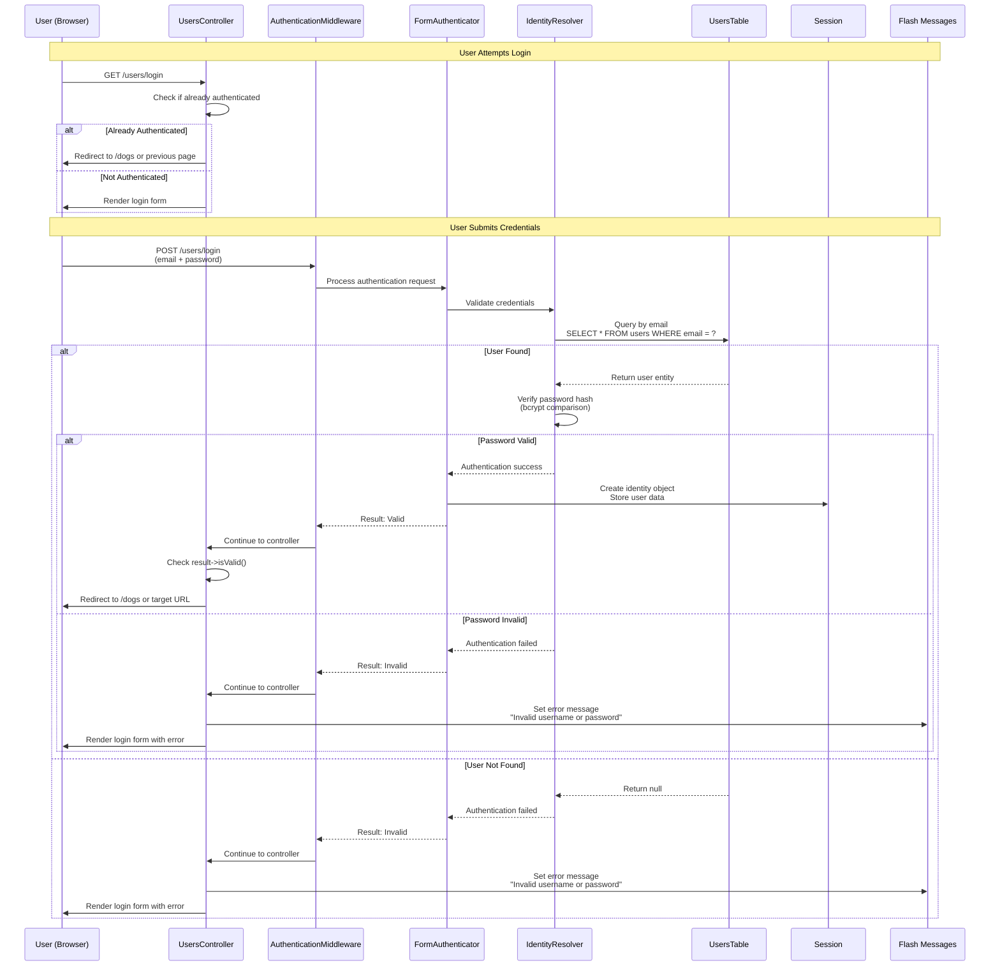
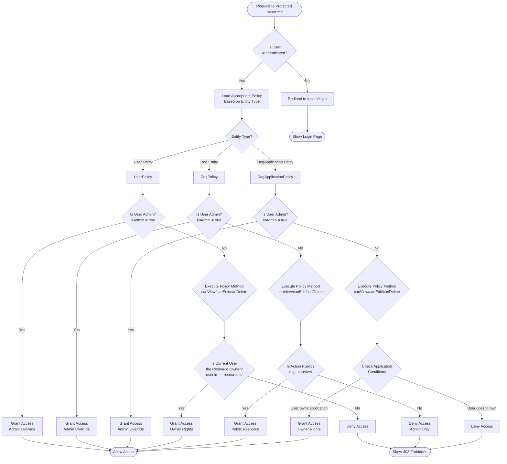
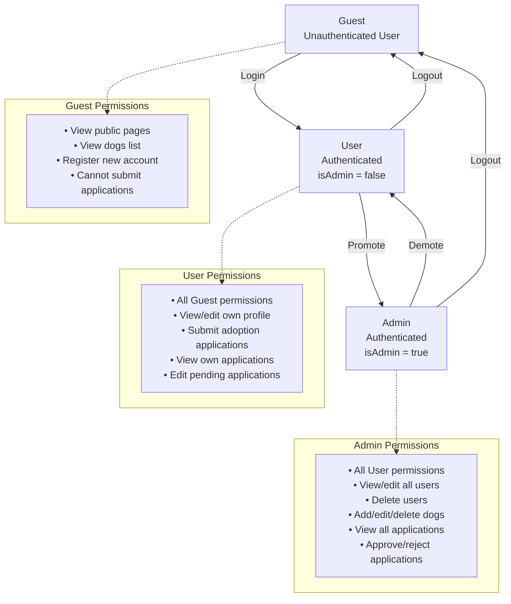

# Authentication & Authorization Flow

**Last Updated:** November 1, 2025

This document provides a comprehensive overview of the authentication and authorization mechanisms in the Hannah's Haus Cake application, a CakePHP 4.x dog adoption management system. The application implements a robust security model using CakePHP's Authentication and Authorization plugins to protect user data and control access to various features.

## Overview

The Hannah's Haus Cake application employs a two-layer security model:

- **Authentication**: Verifies the identity of users through email/password credentials, managing sessions to maintain logged-in state
- **Authorization**: Controls what authenticated users can do based on their roles and ownership of resources

The system uses:
- **CakePHP Authentication Plugin** (`cakephp/authentication`) for identity verification and session management
- **CakePHP Authorization Plugin** (`cakephp/authorization`) for policy-based access control
- **Email-based login** with bcrypt password hashing
- **Role-based permissions** through the `users.isAdmin` boolean flag

## Authentication Flow

Authentication ensures that users are who they claim to be. The system uses form-based authentication with session persistence, allowing users to remain logged in across multiple requests.

### Login Process Sequence Diagram

The following sequence diagram illustrates the complete login flow from initial request to successful authentication:

### Session Management

After successful authentication:
- User identity is stored in the PHP session
- Session cookie is sent to the browser
- All subsequent requests include the session cookie
- AuthenticationMiddleware checks session on each request
- Identity remains valid until logout or session expiry

### Public vs Protected Actions

The application defines public actions that don't require authentication:
- **Global defaults** (in `AppController::beforeFilter()`): `index`, `view`, `/`
- **User-specific** (in `UsersController::beforeFilter()`): `login`, `logout`, `add` (registration)

All other controller actions require authentication and will redirect to `/users/login` if accessed without a valid session.

## Authorization Flow

Authorization determines what authenticated users are allowed to do. The system uses policy-based authorization where each entity type has a corresponding policy class defining access rules.

### Authorization Decision Flowchart

The following flowchart shows how the system makes authorization decisions:

### Policy Resolution

The ORM Resolver automatically maps entities to their corresponding policy classes:
- `App\Model\Entity\User` → `App\Policy\UserPolicy`
- `App\Model\Entity\Dog` → `App\Policy\DogPolicy`
- `App\Model\Entity\DogApplication` → `App\Policy\DogApplicationPolicy`

Policy methods follow the naming convention: `can` + Action (e.g., `canView`, `canEdit`, `canDelete`, `canAdd`)

## Role-Based Access Control

The system implements a simple but effective role hierarchy based on the `users.isAdmin` boolean field.

### Role Hierarchy and Permissions

### Permission Matrix

| Resource | Action | Guest | User | Admin |
|----------|--------|-------|------|-------|
| **Users** |
| | View Index | ✓ | ✓ | ✓ |
| | View Profile | ✗ | Own only | All |
| | Edit Profile | ✗ | Own only | All |
| | Delete User | ✗ | ✗ | ✓ |
| | Register | ✓ | ✓ | ✓ |
| **Dogs** |
| | View List | ✓ | ✓ | ✓ |
| | View Details | ✓ | ✓ | ✓ |
| | Add Dog | ✗ | ✗ | ✓ |
| | Edit Dog | ✗ | ✗ | ✓ |
| | Delete Dog | ✗ | ✗ | ✓ |
| **Applications** |
| | Submit | ✗ | ✓ | ✓ |
| | View | ✗ | Own only | All |
| | Edit | ✗ | Own (pending only) | All |
| | Delete | ✗ | ✗ | ✓ |
| | Approve/Reject | ✗ | ✗ | ✓ |

## Policy Details

### UserPolicy (`src/Policy/UserPolicy.php`)

Controls access to user profiles and account management:

- **canView**: Admins can view all users; users can view their own profile
- **canEdit**: Admins can edit all users; users can edit their own profile
- **canDelete**: Only admins can delete user accounts
- **canAdd**: Anyone can register (public registration)

### DogPolicy (`src/Policy/DogPolicy.php`)

Manages permissions for dog-related operations:

- **canView**: Public access (anyone can view dogs)
- **canAdd**: Admin-only (add new dogs to the system)
- **canEdit**: Admin-only (prevents users from manipulating dog data)
- **canDelete**: Admin-only (remove dogs from the system)
- **isOwner**: Helper method to check if user has adopted a specific dog

### DogApplicationPolicy (`src/Policy/DogApplicationPolicy.php`)

Controls the adoption application workflow:

- **canView**: Admins see all; users see their own applications
- **canAdd**: Any authenticated user can submit applications
- **canEdit**: Admins can edit any; users can edit their own pending applications only
- **canDelete**: Admin-only
- **canApprove**: Admin-only (approve adoption applications)
- **canReject**: Admin-only (reject adoption applications)

### Ownership Pattern

Many policies implement an ownership pattern where users have elevated permissions for resources they own:
- Users can edit their own profiles but not others'
- Users can view their own applications but not others'
- Users can edit their own pending applications but not approved ones

### Admin Override Pattern

All policies check for admin status first, granting full access if `isAdmin = true`. This provides a consistent privilege escalation mechanism across the application.

## Security Considerations

### Password Security
- **Hashing Algorithm**: bcrypt (via CakePHP's DefaultPasswordHasher)
- **Complexity Requirements**: Uppercase, lowercase, number, special character, minimum 8 characters
- **Storage**: Hashed passwords stored in `users.password` field
- **Comparison**: Constant-time comparison to prevent timing attacks

### Session Security
- **Storage**: Server-side PHP sessions
- **Cookie Settings**: HttpOnly flag enabled to prevent XSS attacks
- **Session Regeneration**: On successful login to prevent session fixation
- **Timeout**: Configurable session timeout (default PHP settings)

### CSRF Protection
- **Middleware**: CsrfProtectionMiddleware enabled globally
- **Token Validation**: All POST/PUT/DELETE requests require valid CSRF token
- **Token Storage**: Stored in session and included in forms via FormHelper
- **Cookie Settings**: HttpOnly enabled for CSRF cookie

### Redirect Security
- **Login Redirect**: Stores original URL in query parameter to redirect after login
- **Validation**: Validates redirect URLs to prevent open redirect vulnerabilities
- **Default Redirect**: Falls back to `/dogs` if no valid redirect URL provided

## Related Code References

Key files implementing authentication and authorization:

- **`src/Application.php:157-191`** - Authentication service configuration
  - Configures email-based authentication
  - Sets up session and form authenticators
  - Defines login redirect behavior

- **`src/Application.php:200-205`** - Authorization service configuration
  - Initializes ORM policy resolver
  - Creates authorization service

- **`src/Application.php:117-119`** - Middleware stack
  - Adds AuthenticationMiddleware
  - Adds AuthorizationMiddleware

- **`src/Controller/AppController.php:46-47`** - Component loading
  - Loads Authentication component
  - Loads Authorization component

- **`src/Controller/AppController.php:56-62`** - Public action configuration
  - Sets default public actions (index, view)

- **`src/Controller/UsersController.php:14-24`** - User-specific auth configuration
  - Allows unauthenticated access to login, logout, add
  - Skips authorization for public actions

- **`src/Controller/UsersController.php:131-142`** - Login action implementation
  - Handles login form display and processing
  - Manages authentication result and redirects

- **`src/Controller/UsersController.php:149-155`** - Logout action
  - Clears authentication session
  - Redirects to login page

- **`src/Policy/UserPolicy.php`** - User authorization rules
- **`src/Policy/DogPolicy.php`** - Dog authorization rules
- **`src/Policy/DogApplicationPolicy.php`** - Application authorization rules

## See Also

- [CLAUDE.md - Authentication System](../../CLAUDE.md#authentication-system) - Project-specific authentication configuration
- [CLAUDE.md - Authorization System](../../CLAUDE.md#authorization-system) - Project-specific authorization configuration
- [CakePHP Authentication Documentation](https://book.cakephp.org/authentication/2/en/index.html)
- [CakePHP Authorization Documentation](https://book.cakephp.org/authorization/2/en/index.html)