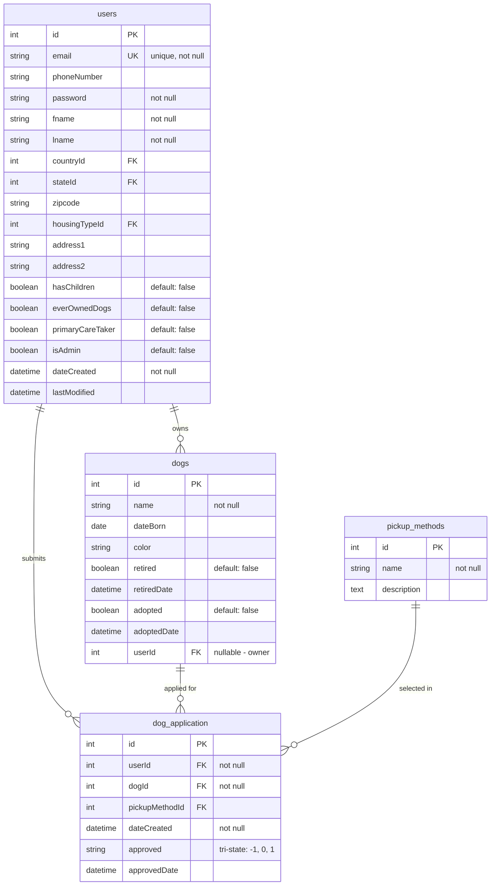

# Core Domain Model - Entity Relationship Diagram

**Last Updated:** November 1, 2025
**Description:** ERD showing the core business entities for the Hannah's Haus Cake dog adoption management system

## Overview

This diagram illustrates the primary domain entities and their relationships in the dog adoption system. It focuses on the core workflow of users applying to adopt dogs, including the approval process and ownership tracking.

## Context

This ERD represents the heart of the Hannah's Haus Cake application, modeling the fundamental business logic of dog adoption. The diagram shows how users interact with the system to browse available dogs, submit adoption applications, and track the approval workflow. This core model works in conjunction with various lookup tables (shown in the [User Profile & Lookup Tables ERD](./database-erd-lookups.md)) to provide complete user profiles and application details.

## Entity Relationship Diagram

## Explanation

The core domain model centers around three main entities that drive the adoption workflow:

### Users Entity
The `users` table serves as the central entity, containing both authentication credentials and profile information. Key fields include:
- **isAdmin**: Boolean flag controlling administrative permissions throughout the application
- **Profile fields**: Housing, children, and pet ownership history inform adoption eligibility
- **Custom timestamps**: Uses `dateCreated` and `lastModified` instead of CakePHP's default `created`/`modified`

### Dogs Entity
The `dogs` table tracks all dogs in the system with soft delete patterns:
- **userId**: Nullable foreign key - dogs without owners are available for adoption
- **retired/retiredDate**: Soft delete pattern for dogs no longer available
- **adopted/adoptedDate**: Tracks successful adoption status and timing

### Dog Application Entity
The `dog_application` table manages the adoption request workflow:
- **Tri-state approval**: The `approved` field uses string values ("-1", "0", "1") representing rejected, pending, and approved states
- **approvedDate**: Timestamps when approval decisions are made
- **pickupMethodId**: Links to user's preferred pickup arrangement

## Key Components

- **users**: Core user entity with authentication, profile data, and authorization flags
- **dogs**: Represents all dogs in the system, both available and adopted
- **dog_application**: Junction table with workflow state, linking users to dogs they wish to adopt
- **pickup_methods**: Lookup table for delivery/pickup preferences (Flexible, Will Pickup, Requires Delivery)

## Important Relationships

### User → Dog Application (One-to-Many)
- **Cardinality**: One user can submit multiple adoption applications
- **Constraint**: userId in dog_application is NOT NULL - every application must have an applicant
- **Business Rule**: Users can apply for multiple dogs over time

### Dog → Dog Application (One-to-Many)
- **Cardinality**: One dog can have multiple applications from different users
- **Constraint**: dogId in dog_application is NOT NULL - every application must reference a dog
- **Business Rule**: Multiple users may compete to adopt the same dog

### User → Dog (One-to-Many, Optional)
- **Cardinality**: One user can own multiple dogs
- **Constraint**: userId in dogs table is NULLABLE - not all dogs have owners
- **Business Rule**: Dogs without owners are available for adoption; dogs with owners have been successfully adopted

### Pickup Method → Dog Application (One-to-Many)
- **Cardinality**: One pickup method can be selected in multiple applications
- **Constraint**: pickupMethodId is optional in dog_application
- **Business Rule**: Applicants specify their preferred method for receiving the dog

## Schema Patterns

### Approval Workflow Pattern
The `dog_application.approved` field implements a tri-state workflow:
- **"-1"**: Application rejected
- **"0"**: Application pending review (default)
- **"1"**: Application approved

This string-based approach (rather than integer or boolean) is non-standard but provides clear state representation. The accompanying `approvedDate` field tracks when decisions are made.

### Soft Delete Pattern
The dogs table implements soft deletes through two mechanisms:
1. **Retirement**: `retired` boolean + `retiredDate` timestamp for dogs no longer available
2. **Adoption**: `adopted` boolean + `adoptedDate` timestamp for successfully placed dogs

This preserves historical data while removing dogs from available listings.

### Authorization Pattern
The `users.isAdmin` boolean flag drives policy-based authorization throughout the application. Admin users can:
- Approve/reject adoption applications
- Manage all dogs in the system
- Access administrative functions

## Related Code References

### Model Layer
- **Table Classes**:
  - `src/Model/Table/UsersTable.php`
  - `src/Model/Table/DogsTable.php`
  - `src/Model/Table/DogApplicationTable.php`
  - `src/Model/Table/PickupMethodsTable.php`
- **Entity Classes**:
  - `src/Model/Entity/User.php`
  - `src/Model/Entity/Dog.php`
  - `src/Model/Entity/DogApplication.php`

### Migration Files
- Users table: `config/Migrations/20240303101847_CreateUsersTable.php`
- Dogs table: `config/Migrations/20240303105316_CreateDogsTable.php`
- Dog application: `config/Migrations/20240303111058_CreateDogApplicationTable.php`
- Pickup methods: `config/Migrations/20240303110936_CreatePickupMethodsTable.php`

### Authorization Policies
- `src/Policy/UserPolicy.php` - User profile access control
- `src/Policy/DogPolicy.php` - Dog management permissions
- `src/Policy/DogApplicationPolicy.php` - Application submission permissions

## Notes on Non-Standard Patterns

1. **camelCase Column Names**: The schema uses camelCase (e.g., `userId`, `dateCreated`) instead of CakePHP's conventional snake_case
2. **Custom Timestamps**: Uses `dateCreated`/`lastModified` instead of CakePHP's default `created`/`modified`
3. **String Approval State**: The `approved` field uses string values ("-1", "0", "1") rather than integer or enum types
4. **Nullable Foreign Keys**: The `dogs.userId` allows null values to represent available dogs

## See Also

- [User Profile & Lookup Tables ERD](./database-erd-lookups.md) - Complete user profile structure and lookup relationships
- [CLAUDE.md](../../CLAUDE.md#architecture) - Architecture overview and conventions
- [CakePHP Associations Documentation](https://book.cakephp.org/4/en/orm/associations.html)