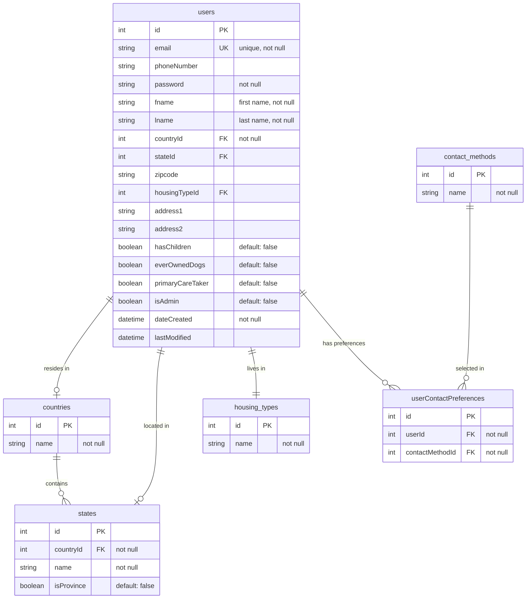

# User Profile & Lookup Tables - Entity Relationship Diagram

**Last Updated:** November 1, 2025
**Description:** ERD showing the complete user profile structure and all lookup table relationships in the Hannah's Haus Cake system

## Overview

This diagram illustrates the comprehensive user profile system and its relationships with various lookup tables. It demonstrates how the application manages user demographics, geographic data, housing information, and communication preferences through a normalized database structure.

## Context

This ERD complements the [Core Domain Model](./database-erd-core.md) by showing the complete user profile infrastructure. The lookup tables provide standardized options for user data entry, ensuring data consistency and enabling features like dynamic state selection based on country. The many-to-many relationship for contact preferences demonstrates advanced user preference management.

## Entity Relationship Diagram



## Explanation

The user profile system employs multiple lookup tables to standardize and validate user data entry while maintaining flexibility for international users.

### Complete User Profile Structure
The `users` table contains extensive profile information organized into several categories:

**Identity & Authentication:**
- `email`: Unique identifier and login credential
- `password`: Encrypted authentication credential
- `fname`, `lname`: User's full name

**Geographic Information:**
- `countryId`: Links to countries table (USA, Canada)
- `stateId`: Links to states/provinces based on selected country
- `zipcode`: Postal code for detailed location
- `address1`, `address2`: Full street address

**Housing & Lifestyle:**
- `housingTypeId`: Type of residence (House, Apartment, Other)
- `hasChildren`: Important for dog placement considerations
- `everOwnedDogs`: Previous pet ownership experience
- `primaryCareTaker`: Indicates responsibility level

**System Fields:**
- `isAdmin`: Authorization flag for administrative privileges
- `dateCreated`, `lastModified`: Audit timestamps (non-standard naming)

### Geographic Hierarchy
The countries → states relationship implements a cascading geographic model:
- **countries** table seeds with USA and Canada
- **states** table contains 64 entries (50 US states + 14 Canadian provinces/territories)
- **isProvince** flag distinguishes Canadian provinces from US states
- **CASCADE delete** ensures referential integrity - deleting a country removes all associated states

### Contact Preferences (Many-to-Many)
The `userContactPreferences` junction table enables flexible communication preference management:
- Users can select multiple preferred contact methods
- Contact methods are standardized in the lookup table
- Junction table pattern allows easy addition of new contact methods without schema changes

## Key Components

### Primary Tables
- **users**: Central user entity with complete profile information
- **userContactPreferences**: Junction table enabling many-to-many contact method selection

### Geographic Lookup Tables
- **countries**: Standardized country list (currently USA and Canada)
- **states**: State/province list with country association and type flag

### Profile Lookup Tables
- **housing_types**: Standardized housing categories (House, Apartment, Other)
- **contact_methods**: Available communication channels for user preferences

## Important Relationships

### Countries → States (One-to-Many with CASCADE)
- **Cardinality**: One country contains multiple states/provinces
- **Constraint**: countryId in states is NOT NULL with CASCADE delete
- **Business Rule**: Deleting a country automatically removes all associated states
- **Implementation**: Enables dynamic state dropdown based on country selection

### Users → Countries (Many-to-One)
- **Cardinality**: Many users can be from the same country
- **Constraint**: countryId in users is NOT NULL
- **Business Rule**: Every user must specify their country of residence

### Users → States (Many-to-One, Optional)
- **Cardinality**: Many users can be from the same state
- **Constraint**: stateId in users is NULLABLE
- **Business Rule**: State selection is optional (may not apply to all countries)

### Users → Housing Types (Many-to-One)
- **Cardinality**: Many users can have the same housing type
- **Constraint**: housingTypeId references housing_types table
- **Business Rule**: Housing type affects adoption eligibility and requirements

### Users ↔ Contact Methods (Many-to-Many)
- **Cardinality**: Users can select multiple contact methods, each method can be selected by multiple users
- **Junction Table**: userContactPreferences links users to contact_methods
- **Business Rule**: Allows flexible communication preference management

## Schema Patterns

### Geographic Cascade Pattern
The countries → states relationship uses CASCADE delete to maintain referential integrity:
```sql
FOREIGN KEY (countryId) REFERENCES countries(id) ON DELETE CASCADE
```
This ensures that removing a country automatically cleans up all associated state records, preventing orphaned data.

### Many-to-Many Junction Pattern
The userContactPreferences table implements a classic many-to-many relationship:
1. **Normalization**: Separates user data from preference data
2. **Flexibility**: New contact methods can be added without altering user schema
3. **Scalability**: Users can have unlimited contact preferences

### Lookup Table Pattern
All lookup tables follow a consistent structure:
- Simple id + name columns for basic lookups (countries, housing_types, contact_methods)
- Extended attributes where needed (states includes isProvince flag)
- Seed data migrations ensure consistent initial data

### Profile Completeness Pattern
The user profile design supports progressive disclosure:
- Required fields: email, password, name, country
- Optional fields: state, address details, phone
- Lifestyle fields: children, pet history, caretaker status

## Related Code References

### Model Layer
- **Table Classes**:
  - `src/Model/Table/UsersTable.php`
  - `src/Model/Table/CountriesTable.php`
  - `src/Model/Table/StatesTable.php`
  - `src/Model/Table/HousingTypesTable.php`
  - `src/Model/Table/ContactMethodsTable.php`
  - `src/Model/Table/UserContactPreferencesTable.php`

### Migration Files
- Users table: `config/Migrations/20240303101847_CreateUsersTable.php`
- User profile fields: `config/Migrations/20240318080058_AddFieldsToUsers.php`
- Countries: `config/Migrations/20240303110547_CreateCountriesTable.php`
- States: `config/Migrations/20240303110639_CreateStatesTable.php`
- Housing types: `config/Migrations/20240303110715_CreateHousingTypesTable.php`
- Contact methods: `config/Migrations/20240303110524_CreateContactMethodsTable.php`
- User contact preferences: `config/Migrations/20240303111216_CreateUserContactPreferencesTable.php`

### Seed Data Migrations
- Countries data: `config/Migrations/20240303132025_SeedCountriesTable.php`
- States data: `config/Migrations/20240303132129_SeedStatesTable.php`
- Housing types data: `config/Migrations/20240303132241_SeedHousingTypesTable.php`
- Pickup methods data: `config/Migrations/20240303132346_SeedPickupMethodsTable.php`

### Frontend Integration
- Dynamic state selection: `webroot/js/Users/add.js`
- Conditional address fields based on housing type
- Client-side validation for profile completeness

## Notes on Design Decisions

### Non-Standard Patterns
1. **camelCase Naming**: All column names use camelCase (e.g., `userId`, `contactMethodId`) instead of snake_case
2. **Custom Timestamps**: `dateCreated`/`lastModified` instead of CakePHP's `created`/`modified`
3. **String Boolean in States**: The `isProvince` field uses boolean type to distinguish provinces

### Data Integrity Considerations
1. **Referential Integrity**: All foreign keys maintain strict relationships
2. **CASCADE Operations**: Only used for countries→states where logical (deleting a country should remove its states)
3. **Nullable Foreign Keys**: stateId is nullable to accommodate countries without states/provinces
4. **Unique Constraints**: email field has unique constraint to prevent duplicate accounts

### Scalability Patterns
1. **Lookup Tables**: Easy to extend with new values without schema changes
2. **Junction Tables**: Contact preferences can grow without affecting user table
3. **Geographic Flexibility**: System can accommodate additional countries and their subdivisions

## See Also

- [Core Domain Model ERD](./database-erd-core.md) - Primary business entities and adoption workflow
- [CLAUDE.md](../../CLAUDE.md#architecture) - Architecture overview and conventions
- [CakePHP Table Associations](https://book.cakephp.org/4/en/orm/associations.html)
- [Database Migrations Directory](../../config/Migrations/) - Complete migration history