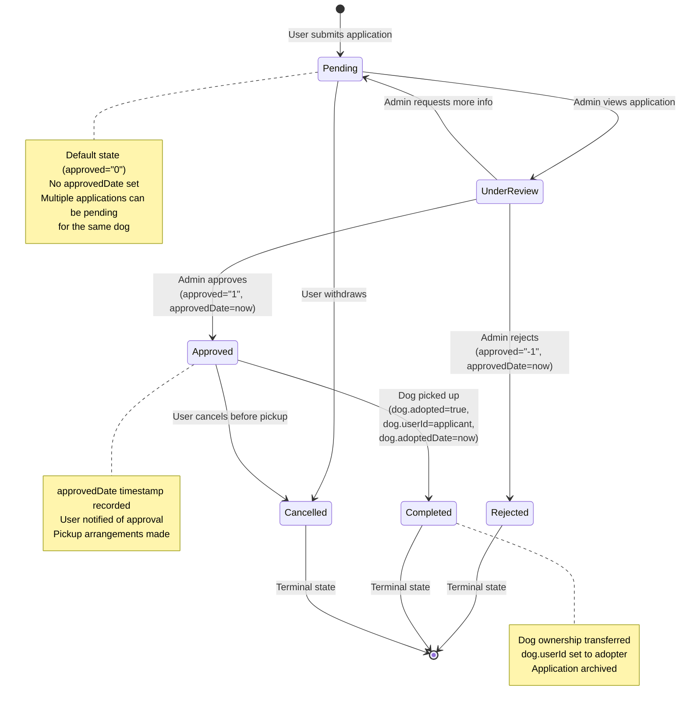
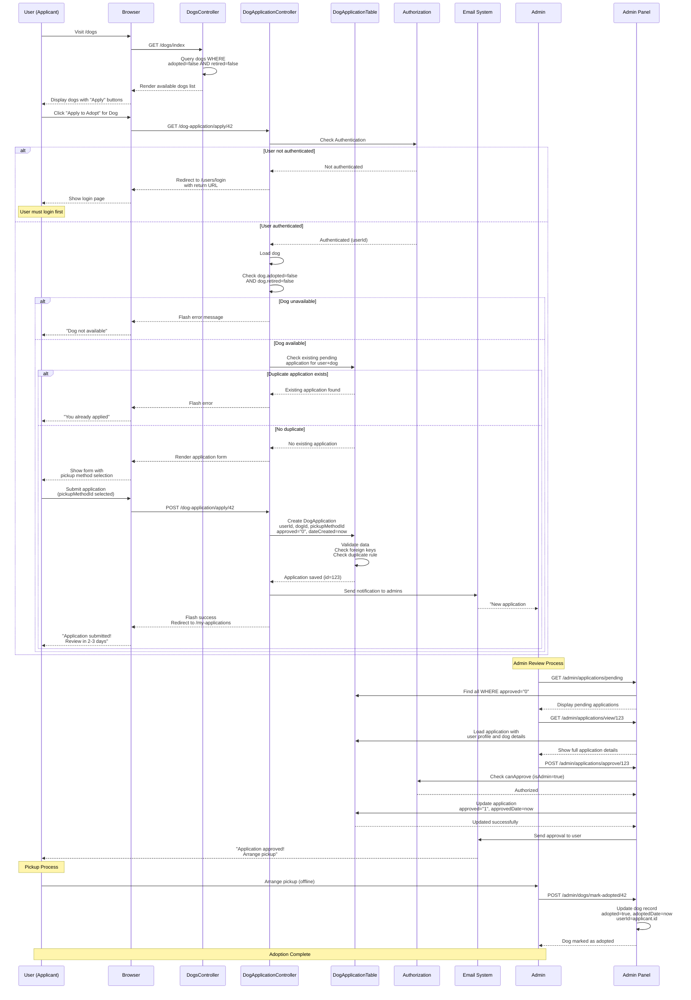

# Dog Adoption Application Workflow

**Last Updated:** November 1, 2025

## Overview

The Hannah's Haus Cake adoption system manages the complete lifecycle of dog adoption applications, from initial user interest through final adoption completion. This document details the workflow, state transitions, and business processes that govern how users apply to adopt dogs and how administrators review and approve these applications.

### Key Stakeholders

- **Applicants (Users):** Registered users who submit adoption applications for available dogs
- **Administrators:** Staff members with `isAdmin` privileges who review and approve/reject applications
- **Dogs:** The animals available for adoption, tracked with adoption and retirement status

### Process Goals

- Match dogs with qualified, caring adopters through a structured application process
- Ensure thorough review of applicant qualifications and housing situations
- Maintain audit trail of all adoption decisions with timestamps
- Prevent duplicate applications and manage concurrent applications efficiently

## Application Lifecycle

The adoption application system uses a tri-state approval system to track application status through its lifecycle. The `approved` field uses string values ("-1", "0", "1") rather than integers or booleans to allow for future expansion of statuses while maintaining database compatibility.

### State Diagram



### State Explanations

- **Pending (`approved = "0"`):** Initial state when application is submitted. The application awaits admin review. Multiple users can have pending applications for the same dog simultaneously.

- **Under Review:** Transitional state when an admin is actively reviewing the application. Not stored in database but represents the active review process.

- **Approved (`approved = "1"`):** Admin has approved the application. The `approvedDate` is set to record when the decision was made. User is notified to arrange pickup.

- **Rejected (`approved = "-1"`):** Admin has rejected the application. The `approvedDate` is set for audit purposes. This is a terminal state.

- **Completed:** The adoption is finalized. The dog's `adopted` flag is set to `true`, `adoptedDate` is recorded, and `userId` is set to the new owner's ID. This is a terminal state.

- **Cancelled:** User withdrew their application before completion. This could happen either from pending state or after approval but before pickup. This is a terminal state.

### Terminal States

Terminal states (Rejected, Completed, Cancelled) cannot transition to any other state. These applications are kept in the database for historical records and audit purposes, following the soft delete pattern used throughout the application.

## User Journey

The complete adoption journey from a user's perspective, showing all system interactions and authorization checks.

### Sequence Diagram



### Alternative Flows

The sequence diagram above shows the happy path. Several alternative flows can occur:

1. **User Not Authenticated:** Redirected to login with return URL to resume application after authentication
2. **Dog Already Adopted/Retired:** Error message displayed, user redirected to dogs index
3. **Duplicate Pending Application:** User informed they already have a pending application for this dog
4. **Admin Rejects Application:** Same flow as approval but sets `approved = "-1"` instead
5. **Admin Requests More Information:** Application remains in pending state, user contacted outside system

## Admin Approval Process

Administrators review applications using a structured decision process that considers multiple factors about the applicant and their suitability for the specific dog.

### Approval Decision Flowchart

```mermaid
flowchart TD
    Start([Admin views pending application #123]) --> LoadData[Load application with<br/>user profile and dog details]

    LoadData --> ReviewHousing{Review Housing Situation}

    ReviewHousing --> CheckHouseType[Check housingTypeId:<br/>- House<br/>- Apartment<br/>- Condo<br/>- Other]

    CheckHouseType --> CheckChildren[Check hasChildren flag<br/>Consider dog's temperament]

    CheckChildren --> ReviewHistory{Review Dog<br/>Ownership History}

    ReviewHistory --> CheckExperience[Check everOwnedDogs<br/>Check primaryCareTaker<br/>Review experience level]

    CheckExperience --> ReviewLocation{Review Location}

    ReviewLocation --> CheckAddress[Verify address completeness<br/>Check countryId and stateId<br/>Consider distance for pickup]

    CheckAddress --> CheckPickup{Review Pickup Method}

    CheckPickup --> VerifyPickup[Verify pickupMethodId feasibility<br/>- Local pickup<br/>- Delivery options<br/>- Transport arrangements]

    VerifyPickup --> NeedInfo{More Information<br/>Needed?}

    NeedInfo -->|Yes| ContactUser[Contact user via email/phone<br/>Request additional details]
    ContactUser --> KeepPending[Keep application pending<br/>approved remains "0"]
    KeepPending --> End([End - Await user response])

    NeedInfo -->|No| FinalDecision{Approve<br/>Application?}

    FinalDecision -->|Yes| Approve[Set approved = "1"<br/>Set approvedDate = now<br/>Send approval email]
    Approve --> SchedulePickup[Schedule pickup/delivery<br/>with applicant]
    SchedulePickup --> EndApproved([End - Application Approved])

    FinalDecision -->|No| Reject[Set approved = "-1"<br/>Set approvedDate = now<br/>Send rejection email]
    Reject --> DocumentReason[Document rejection reason<br/>for records]
    DocumentReason --> EndRejected([End - Application Rejected])

    style Start fill:#90EE90
    style EndApproved fill:#90EE90
    style EndRejected fill:#FFB6C1
    style End fill:#FFE4B5
```

### Decision Criteria

Administrators consider the following factors when reviewing applications:

1. **Housing Suitability:** Does the applicant's housing type match the dog's needs?
2. **Family Composition:** Are there children? Is the dog good with children?
3. **Experience Level:** Has the applicant owned dogs before? Were they the primary caretaker?
4. **Location Feasibility:** Can pickup/delivery be reasonably arranged?
5. **Application Completeness:** Is all required information provided?
6. **Dog-Specific Requirements:** Any special needs or restrictions for this particular dog?

## Database State Changes

The following table shows how database fields change at each step of the adoption process:

| Step | Table | Field Changes | Notes |
|------|-------|---------------|-------|
| **Application Submission** | `dog_application` | - `userId` = applicant ID<br>- `dogId` = selected dog<br>- `pickupMethodId` = selected method<br>- `dateCreated` = current timestamp<br>- `approved` = "0"<br>- `approvedDate` = NULL | New record created |
| **Admin Approval** | `dog_application` | - `approved` = "1"<br>- `approvedDate` = current timestamp | Existing record updated |
| **Admin Rejection** | `dog_application` | - `approved` = "-1"<br>- `approvedDate` = current timestamp | Existing record updated |
| **Dog Pickup/Adoption Complete** | `dogs` | - `adopted` = true<br>- `adoptedDate` = current timestamp<br>- `userId` = adopter's ID | Dog record updated, ownership transferred |
| **Dog Retirement** | `dogs` | - `retired` = true<br>- `retiredDate` = current timestamp | Dog no longer available for adoption |

### Soft Delete Pattern

The application follows a soft delete pattern throughout:
- Dogs are never deleted from the database, only marked as `adopted` or `retired`
- Applications are kept for historical records even after rejection or completion
- This preserves audit trails and allows for reporting on adoption history

## Business Rules

The following business rules govern the adoption application process:

### Authentication & Authorization

1. **Users must be authenticated to apply** - Anonymous users are redirected to login
2. **Only admins can approve/reject applications** - Enforced via `DogApplicationPolicy::canApprove()` and `canReject()`
3. **Users can only view their own applications** - Unless they have admin privileges
4. **Users can only edit pending applications** - Once approved/rejected, applications are locked

### Application Constraints

1. **Dogs must be available** - Not adopted (`adopted = false`) and not retired (`retired = false`)
2. **No duplicate pending applications** - One user cannot have multiple pending applications for the same dog
3. **Multiple users can apply for the same dog** - Applications are processed competitively
4. **Pickup method is required** - Users must specify how they'll receive the dog

### Approval Process

1. **Only one final owner per dog** - The `dogs.userId` field enforces single ownership
2. **Approval timestamp is mandatory** - `approvedDate` must be set when status changes from pending
3. **Approved applications can be cancelled** - Before pickup completion
4. **Rejected applications are terminal** - Users must submit a new application to reapply

### Data Integrity

1. **Foreign key constraints enforced** - userId, dogId, and pickupMethodId must reference valid records
2. **Status values are restricted** - Only "-1", "0", or "1" are valid for the `approved` field
3. **Timestamps are immutable** - Once set, `dateCreated` and `approvedDate` should not change

## Edge Cases & Error Handling

### Concurrent Applications

**Scenario:** Multiple users apply for the same dog simultaneously

**Handling:**
- All applications are accepted and marked pending
- Admin reviews all applications and chooses the best match
- When one application is approved, admin should reject others
- System allows multiple pending applications by design

### Post-Approval Cancellation

**Scenario:** User cancels approved application before pickup

**Handling:**
- Application status could be updated to a cancelled state (would require schema change)
- Dog remains available (`adopted = false`)
- Other pending applications can be reconsidered
- Admin manually handles reallocation

### Dog Status Changes During Application

**Scenario:** Dog is retired while applications are pending

**Handling:**
- Pending applications should be rejected with reason
- Users notified via email about dog unavailability
- Admin responsible for closing out pending applications

### Duplicate Application Attempts

**Scenario:** User tries to submit second application for same dog

**Handling:**
- Enforced by `DogApplicationTable::buildRules()`
- Custom rule `uniquePendingApplication` prevents duplicates
- User redirected to their applications page with error message

### Invalid Pickup Method

**Scenario:** Selected pickup method becomes unavailable

**Handling:**
- Admin contacts user to arrange alternative
- Application can be edited by admin to update pickup method
- Flexibility maintained through admin override capabilities

## Related Code References

### Models
- `src/Model/Table/DogApplicationTable.php` - Application model with validation rules and associations
- `src/Model/Entity/DogApplication.php` - Application entity with property definitions
- `src/Model/Table/DogsTable.php` - Dogs model with adoption status tracking
- `src/Model/Entity/Dog.php` - Dog entity with adoption and retirement flags

### Controllers
- `src/Controller/DogApplicationController.php` - User-facing application actions
  - `apply()` - Submit new application
  - `myApplications()` - View own applications
  - `view()` - View specific application
- `src/Controller/DogsController.php` - Dog browsing and management
- `src/Controller/Admin/DogApplicationController.php` - Admin application management (if exists)

### Authorization
- `src/Policy/DogApplicationPolicy.php` - Defines who can perform actions on applications
  - `canAdd()` - Any authenticated user
  - `canView()` - Owner or admin
  - `canEdit()` - Owner (pending only) or admin
  - `canApprove()` / `canReject()` - Admin only

### Database Migrations
- `config/Migrations/20240303111058_CreateDogApplications.php` - Application table schema
- `config/Migrations/20240303105316_CreateDogsTable.php` - Dogs table with adoption fields

### Templates
- `templates/DogApplication/apply.php` - Application submission form
- `templates/DogApplication/my_applications.php` - User's application list
- `templates/Dogs/index.php` - Available dogs listing with apply buttons

## Implementation Notes

### Tri-State String Values

The `approved` field uses strings ("-1", "0", "1") rather than integers or booleans. This design choice:
- Allows for future expansion of statuses without schema changes
- Maintains compatibility with form helpers and validation
- Provides clear semantic meaning in code
- Supports database indexing efficiently

### Timestamp Tracking

The `approvedDate` field:
- Records exactly when admin made their decision
- Provides audit trail for compliance
- Allows reporting on processing times
- Remains NULL for pending applications

### Authorization Integration

The application integrates with CakePHP's authorization plugin:
- Policy-based access control via `DogApplicationPolicy`
- Method-level authorization in controllers
- Automatic checks before actions execute
- Clear separation of authorization logic

### Email Notifications

While not fully implemented in the current code, the workflow assumes email notifications at key points:
- New application submitted → Admin notification
- Application approved → User notification with pickup instructions
- Application rejected → User notification with reason
- These would typically be implemented using CakePHP's Mailer classes

## See Also

- [Database ERD Diagrams](../architecture/database-erd.md) - Complete database structure
- [Authentication Flow](./auth-flow.md) - User authentication and session management
- [CLAUDE.md](../../CLAUDE.md#dog-adoption-workflow) - High-level workflow description
- [User Registration Flow](./user-registration.md) - New user onboarding process

---

*This document is maintained as part of the Hannah's Haus Cake documentation. For questions or updates, please consult the development team.*